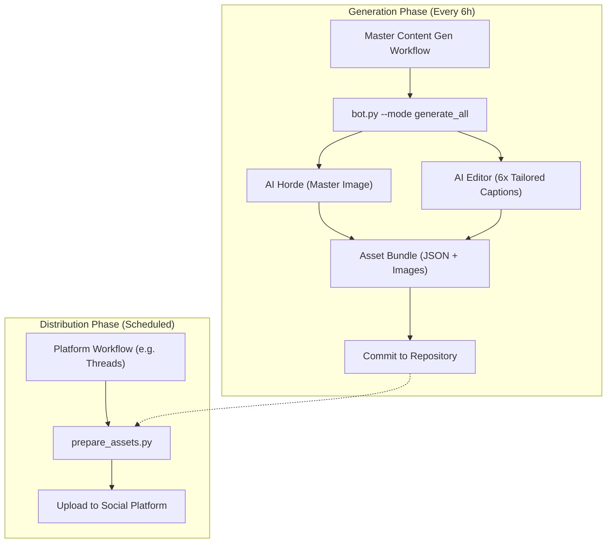

# ig-autobot 🤖📚

**Social Media Automation Bot for M.W.E. Wigman's *The Nine Stitches* Trilogy**

[](https://www.instagram.com/m.w.e_wigman/)
[](https://iyeque.github.io/ig-autobot/)

An intelligent, book-aware automation system that maintains a robust multi-platform social media presence for author **M.W.E. Wigman** with philosophical depth, modern wit, and visual consistency. (Side projects like *Digital Guardian* are managed separately within the repository).

## ✨ What This Does

- 🧠 **Unified Asset Generation** — Phase 6 logic: Generates a single Master Image and 6 platform-tailored captions in one pass. Saves 6x on AI Horde Kudos and ensures 100% visual consistency.
- 🗣️ **Active AI Editor** — Powered by GPT-OSS 120B. Automatically repairs, fixes, and summarizes captions to fit platform character limits perfectly.
- 🎨 **Cinematic Visuals** — High-legibility Reels and Shorts with 75px overlays (mobile-safe), visual 'Pattern Interrupts' at 3s to boost completion rates, and professional watermarking.
- 🌐 **Zero-Inference Publishing** — Posting workflows are decoupled from AI generation. They pick up pre-built assets, making them 100% immune to API timeouts or queue delays.
- 📈 **SEO Optimized** — Smart hashtag selection (3-5 tags) and keyword-dense captioning. No hashtags on Bluesky for a cleaner look.
- 🖼️ **Live Visual Gallery** — A [web-based archive](https://iyeque.github.io/ig-autobot/) that automatically curates and sorts all media chronologically.
- 📅 **Smart Scheduling** — Optimized for 3x daily peak GST engagement.
- 🔄 **Self-Healing Resilience** — Built-in `stash-pull-rebase` logic and automated token refreshes.

## 🏗️ Architecture



---

## 🚀 Quick Start

### 1. Prerequisites
- Python 3.11+
- GitHub account
- API keys: **Cerebras AI**, **AI Horde**, **OCR Space**

### 2. Local Setup
```bash
git clone https://github.com/iyeque/ig-autobot.git
cd ig-autobot
pip install -r requirements.txt
cp .env.example .env
# Edit .env with your keys
```

### 3. GitHub Actions Setup
Add these secrets in `Settings` → `Secrets and variables` → `Actions`:

| Secret | Platform | Description |
| :--- | :--- | :--- |
| `CEREBRAS_API_KEY` | Text | Fallback Caption generation |
| `AI_HORDE_API_KEY` | Text | Primary Caption & Image gen |
| `OCR_SPACE_API_KEY`| Safety | Content filtering |
| `IG_ACCESS_TOKEN` | IG | Graph API token |
| `THREADS_ACCESS_TOKEN` | Threads | API Access Token |
| `THREADS_USER_ID` | Threads | User ID |
| `BLUESKY_HANDLE` | Bluesky | Handle |
| `BLUESKY_PASSWORD` | Bluesky | App Password |
| `YOUTUBE_CLIENT_ID` | YT | OAuth Client ID |
| `YOUTUBE_CLIENT_SECRET` | YT | OAuth Client Secret |
| `YOUTUBE_REFRESH_TOKEN` | YT | Refresh Token |

> 💡 **Pinterest Note**: While in "Trial" tier, the bot uses the **Pinterest Sandbox API**. Ensure your tokens are generated for a Sandbox user in the Pinterest Dev Console.

---

## 📜 License & Attribution
**© 2024–2026 Digital Guardian. All Rights Reserved.**
